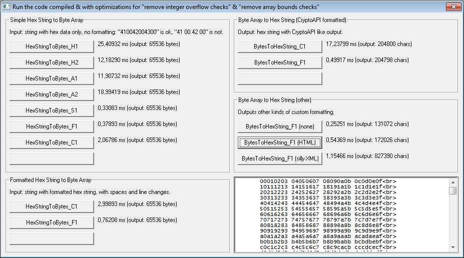

## Hex string & byte array conversions

### Description

These functions convert hex strings from/to byte arrays. A quick introduction to each:

<ul>

<li><b>HexStringToBytes_A1</b>: one of the most common ways to turn hex string to byte string using "&H" string conversion to a byte value.</li>

<li><b>HexStringToBytes_A2</b>: an optimized version of A1, grabs bigger values in one go and reduces amount of strings created.</li>

<li><b>HexStringToBytes_A1</b>: fills byte array using AscW & MidB$</li>

<li><b>HexStringToBytes_A2</b>: same as before, but uses the passed string as a buffer instead just for comparison. Slower as creates more strings than A1.</li>

<li><b>HexStringToBytes_C1</b>: uses Windows CryptStringToBinary API.</li>

<li><b>HexStringToBytes_S1</b>: uses a lot of advanced VB6 tricks to achieve the greatest speed. API just can't compete with this one.</li>

<li><b>HexStringToBytes_F1</b>: uses advanced VB6 tricks like last one, but allows for any formatting in the passed hex string (such as spaces, line changes or anything else – simply looks for any valid hex pairs it can find).

</ul>

Shortly put: the C1 and F1 functions can parse "41 00 42 00 43 00", with formatting. The others only accept "410042004300", no formatting. Those hex strings would convert into a byte array:

<ul>

<li>B(0) = 65</li>

<li>B(1) = 0</li>

<li>B(2) = 66</li>

<li>B(3) = 0</li>

<li>B(4) = 67</li>

<li>B(5) = 0</li>

</ul>

Or "ABC" as a string (Dim S As String: S = B).

There are also functions working the other way around, BytesToHexString_C1 & BytesToHexString_F1. C1 is a version using CryptBinaryToString API while F1 is an optimized function that <b>allows for custom output formatting</b>! You can have any kind of formatting: none at all, just spaces between each hex pair, HTML, XML, C notation, JSON... use your imagination.

Not only that, the F1 version is way faster than the C1 version with the exact same output!

The following tricks are generally used for speed in the S1 and F1 functions:

<ul>

<li><b>Safe arrays</b>: VB6 stores arrays internally as safe arrays. The function creates "fake" Long and Integer arrays. <b>Integer array</b> for accessing the string data (1 character = 2 bytes = Integer) and a <b>Long array</b> for memory manipulation (PutMem4 & GetMem4 replacement) as well as saving the decoded hex string to the byte array.</li>

<li><b>SysAllocStringByteLen</b>: this API creates a BSTR and it does that very fast, especially if pointer is set to 0, in which case you get any free point from memory. That memory is not touched in any way except for setting up the minimal BSTR structure information (4 bytes string length & 2 bytes null terminator). This memory is <b>not</b> given to a string however! Instead it is given to the resulting <b>Byte array</b>. Why? It saves an unnecessary step of nullifying all the bytes that are reserved, and this always happens if you just ReDim an array.</li>

</ul>

Long is the fastest datatype in VB6 in current processors. This is why a Long array is used to store the new bytes into the Byte array instead of just using it directly.

Summa summarum: these functions should give good knowledge for anyone who wants to understand how memory can be handled so that you achieve better performance code in VB6. It isn't pretty though.

 
### More Info
 

             |
---                |---
**Submitted On**   |2011-01-31 17:39:22
**By**             |[Vesa Piittinen](https://github.com/Planet-Source-Code/PSCIndex/blob/master/ByAuthor/vesa-piittinen.md)
**Level**          |Advanced
**User Rating**    |5.0 (10 globes from 2 users)
**Compatibility**  |VB 6\.0
**Category**       |[String Manipulation](https://github.com/Planet-Source-Code/PSCIndex/blob/master/ByCategory/string-manipulation__1-5.md)
**World**          |[Visual Basic](https://github.com/Planet-Source-Code/PSCIndex/blob/master/ByWorld/visual-basic.md)
**Archive File**   |[Hex\_string219759262011\.zip](https://github.com/Planet-Source-Code/vesa-piittinen-hex-string-byte-array-conversions__1-73717/archive/master.zip)

